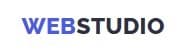
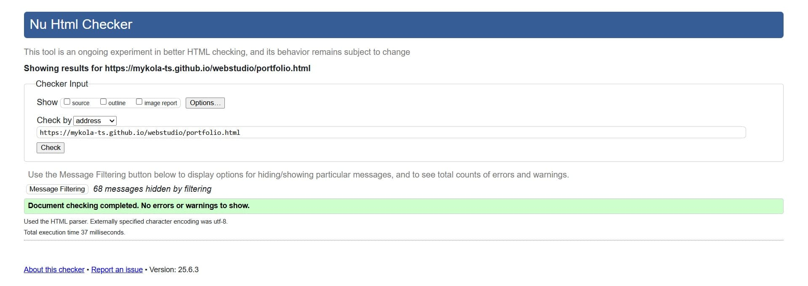

# 🌐💻 WebStudio

WebStudio is a modern digital agency offering high-quality web design,
responsive layouts, and branding solutions to help your business grow online.



## 📑 Table of Contents

- [About the Project](#-about-the-project)

- [Website Structure](#-website-structure)

- [Useful Links](#-useful-links)

- [Technologies Used](#-technologies-used)

- [Libraries Used](#-libraries-used)

- [Folder and File Structure](#-folder-and-file-structure)

- [Features](#-features)

- [PageSpeed Results](#-pagespeed-results)

- [Validation Result](#-validation-result)

- [Installation & Setup](#-installation--setup)

- [Author](#-author)

## 📝 About the Project

This project is a responsive multi-page website developed for **WebStudio**, a
modern digital agency. It showcases the company’s services, team, and clients in
a clean and professional format.

The site is built with semantic HTML and modular CSS, ensuring accessibility,
cross-browser compatibility, and scalability. It includes a responsive layout, a
mobile navigation menu, and a modal window for service orders.


### 🧩 Website Structure

The website consists of two pages:

**Home page** (index.html) — introduces the company and its services.

**Portfolio page** (portfolio.html) — showcases the agency’s completed projects.

Each page contains the following main sections:

🏠 **Home Page**

- **Header** — contains the site logo, a navigation menu linking to key
  sections, contact email, and a phone number clickable on mobile devices, and a
  responsive mobile menu for better usability on small screens;
- **Hero** — a visually engaging section featuring a prominent headline, a
  button that opens a modal request form, and a background image that conveys
  the agency’s digital focus;
- **Modal Window** — a popup form that appears when the user clicks the "Order
  Service" button in the Hero section, allowing visitors to submit a service
  request without leaving the page;
- **Advantages** — highlights the agency’s core strengths such as Strategy,
  Punctuality, Diligence, and Technologies using icons and brief descriptions;
- **Activity** — presents visual examples of the agency's work through a gallery
  of service images;
- **Team** — introduces the team members with profile photos, roles, and links
  to social media;
- **Customers** — displays logos of partner companies and clients to build trust
  and credibility;
- **Footer** — includes a short call to action, social media links, a
  subscription form, and additional navigation.

🗂 **Portfolio Page**

- **Header** — same as on the homepage: logo, navigation menu, email, and phone
  number;
- **Filter** — allows users to filter portfolio projects by categories (e.g.,
  App, Web Site, Design, Marketing);
- **Portfolio** — a grid-based gallery showcasing individual projects with
  images, titles, and categories;
- **Footer** — same as the homepage footer, providing contact, subscription, and
  social media links.

## 🔗 Useful Links

- [Live Demo](https://mykola-ts.github.io/webstudio/) — deployed version of the
  website

- [GitHub Repository](https://github.com/Mykola-Ts/webstudio) — source code of
  the project

- [Figma Design](https://www.figma.com/design/DNYDonWJusLuHxUjzGQlDW/Web-Studio--Version-3.0---Copy-?node-id=297046-1554&p=f&t=iFNWu8mMAEMfkExP-0)
  — the project’s UI/UX design mockup

## 🛠 Technologies Used

- HTML5
- CSS3
- JavaScript (ES6+)
- Vite — modern frontend build tool
- Git / GitHub

## 📦 Libraries Used

- [vite](https://vite.dev/) — next generation frontend tooling (dev server &
  build tool)
- [glob](https://www.npmjs.com/package/glob) — file path pattern matching (used
  for dynamic input in builds)
- [modern-normalize](https://github.com/sindresorhus/modern-normalize) — CSS
  normalization to make built-in browser styling consistent
- [vite-plugin-full-reload](https://www.npmjs.com/package/vite-plugin-full-reload)
  — hot reload for HTML and other non-JS files in Vite
- [vite-plugin-html-inject](https://www.npmjs.com/package/vite-plugin-html-inject)
  — inject variables or partials into HTML at build time

## 📁 Folder and File Structure

- **.github/**: GitHub-specific configuration and workflows.

- **assets/**: Folder stores images used in the README.md file to visually
  document and represent the project.

- **src/**: Folder contains the source code of the application, including all
  essential files such as HTML, CSS, JavaScript, and component logic used to
  build and structure the project:

  - **css/**: CSS files for each section of the site.

  - **fonts/**: Custom fonts used in the project.

  - **images/**: Folder for images and icons used throughout the site.

  - **js/**: Contains JavaScript files for functionality.

  - **partials/**: HTML partials for each section of the site.

  - **public/**: Static assets for Vite (e.g., images, favicons, etc.).

  - **index.html**: The main HTML file for the site.

- **.editorconfig**: Editor configuration file.

- **.gitignore**: Specifies which files and directories to ignore in Git.

- **.prettierrc.json**: Prettier configuration for code formatting.

- **package.json**: Contains metadata about the project and dependencies.

- **README.md**: Project documentation and setup instructions.

- **vite.config.js**: Configuration file for Vite.

## 🎯 Features

- **Responsive Design**  
  Website adapts seamlessly to different screen sizes: desktop, tablet, and
  mobile devices, ensuring a smooth user experience on any device.

- **Mobile Menu**  
  Slide-in mobile navigation menu with backdrop and proper event handling. The
  menu closes when clicking the close button.

- **Leave Your Contacts**  
  Users can leave their contacts in a modal window form with a "Leave your
  contacts and we will call you back" feature, helping users easily get in touch
  with the team.

- **Keyboard Accessibility**  
  Modal window and navigation elements are accessible via keyboard (e.g. Esc to
  close modals).

- **Team Section**  
  Get to know the team in the dedicated Team section, which includes links to
  the social media profiles of team members to learn more about each member and
  stay connected.

- **Customers Showcase**  
  See who trusts us in the Customers section — a testament to our reputation and
  a way to build trust with future clients.

- **Portfolio Overview**  
  On the Portfolio page, view completed projects with short descriptions shown
  in a pop-up overlay when hovering over each project, providing quick insights
  without leaving the page.

- **Portfolio Filtering**  
  Filter portfolio projects by categories such as App, Web Site, Design, and
  Marketing to quickly find projects relevant to your interests.

- **Clean & Modular Code**  
  Code is split into logical modules.

- **Performance & Accessibility**  
  The website achieves high performance, accessibility, best practices, and SEO
  standards. Optimized code and structure ensure fast loading, smooth
  interactions, and an inclusive, user-friendly experience across all devices.

## 🚀 PageSpeed Results

Google's PageSpeed Insights was used to analyze the performance of the WebStudio
website on both mobile and desktop devices. The results highlight strong
performance across various categories, ensuring a smooth user experience.

🏠 **Home Page**

- **📱 Mobile Performance:**


- **💻 Desktop Performance:**


🗂 **Portfolio Page**

- **📱 Mobile Performance:**


- **💻 Desktop Performance:**


These results demonstrate that the website is optimized for both performance and
user experience, ensuring fast loading times and high usability on all devices.

## ✅ Validation Result

The website has been tested with the
[W3C Markup Validation Service](https://validator.w3.org/) and contains no
validation errors or warnings.

🏠 **Home Page**


🗂 **Portfolio Page**



## 🏗 Installation & Setup

To run the project locally, follow these steps:

1. **Clone the repository**
   ```bash
   git clone https://github.com/Mykola-Ts/webstudio.git
   cd webstudio
   ```
2. **Install dependencies**

   ```bash
    npm install
   ```

3. **Start the development server**

   ```bash
    npm run dev
   ```

4. **Open in browser**

Visit http://localhost:5173/ to view the project.

## 👨‍💻 Author

**Mykola Tsybulskyi**

🔗 GitHub https://github.com/Mykola-Ts

🔗 Email tsybulskiyk@gmail.com

🔗 LinkedIn https://www.linkedin.com/in/mykola-tsybulskyi
